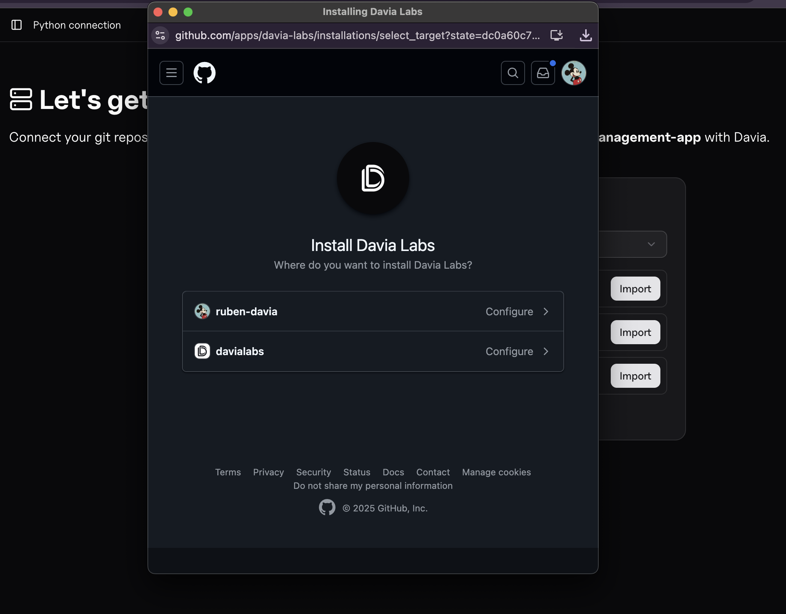
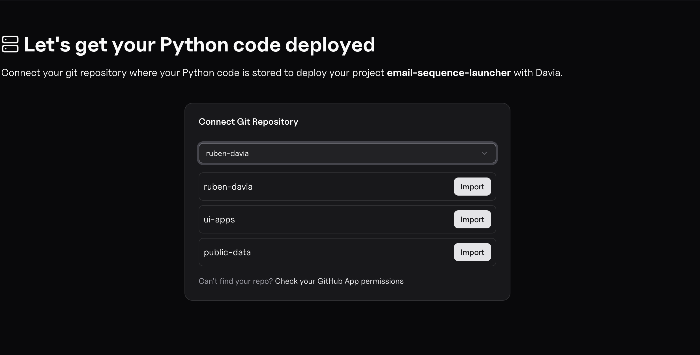
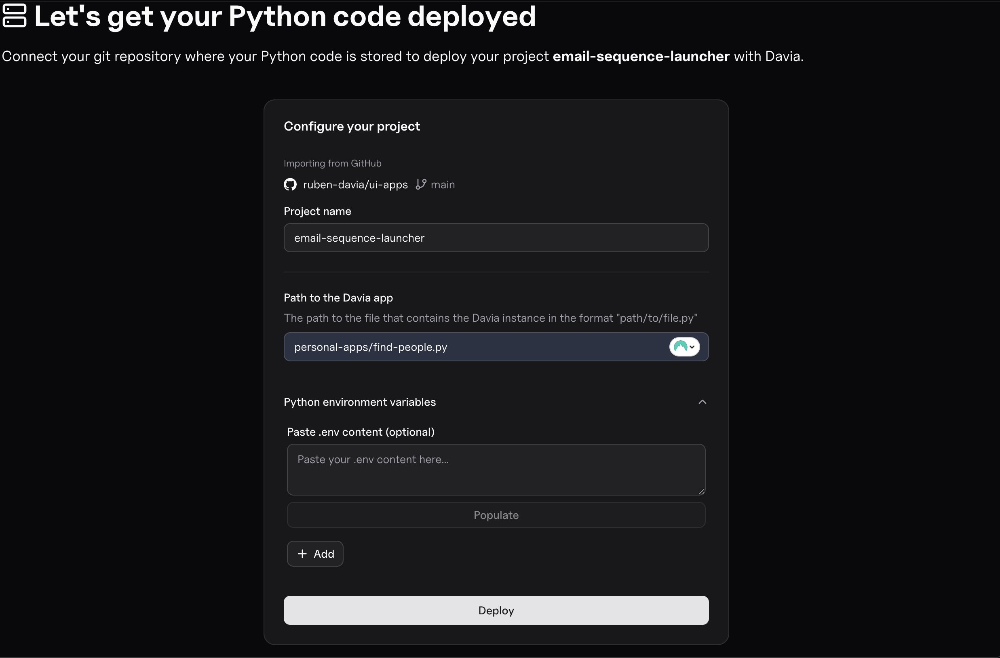
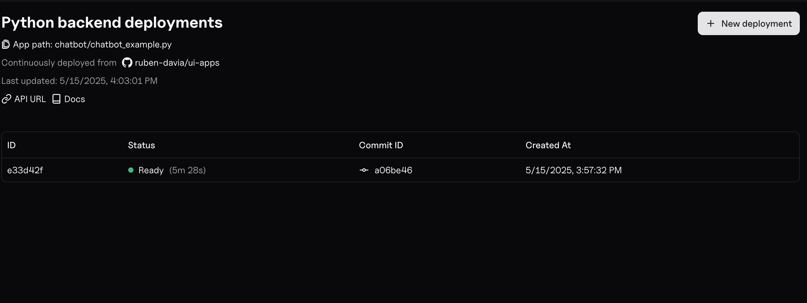

# Deploying the Backend

After clicking the deploy button, the interface will be automatically deployed. You will then be redirected to the backend deployment section for your application code.

Before proceeding, you must have a GitHub repository containing your backend code and Davia application.

## Deployment Steps

### 1. Connect to GitHub and install the Davia app

First, connect to GitHub and install the Davia application.

### 2. Choose your repository

Select the repository where your code is stored.

### 3. Configure your deployment

Next, complete the configuration:

- Specify the file path where your application is defined
- Add all required environment variables

### 4. Deploy your backend

Finally, click the deploy button. Your backend will be automatically deployed.

## Additional Information

### Simplified Deployment Requirements

- No need to set up Docker or any containerization - just your Python code is sufficient for deployment.

### Pro Deployment Specifications

The Pro deployment plan includes:

- 1 vCPU, 512 MiB memory per instance
- Support for up to 80 concurrent requests
- 10M requests/month capacity

### Environment Variables

Remember that you can:

- Use a `.env` file in your local development environment to manage your variables
- Add these same variables directly in the deployment interface
- Format should follow the standard KEY=VALUE pattern
- Sensitive information (API keys, passwords) should always be added as environment variables, never hardcoded

### Alternative Framework Support

- While these instructions focus on Davia applications, you can also deploy FastAPI applications using the same process
- Simply point to your FastAPI application file during the configuration step
