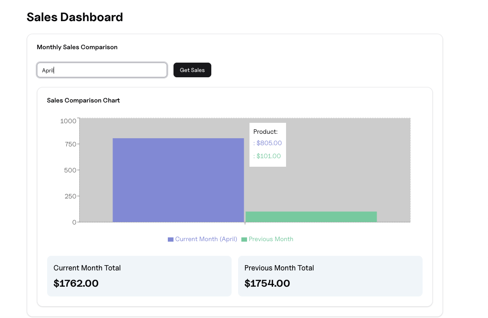

To create this sales dashboard, open your IDE and create a new Python file. Copy and paste the following code:

```python
from davia import Davia
import random, datetime

app = Davia()

@app.task
def compare_sales(month: str) -> dict:
    # Generate random sales for the given and previous month
    now = datetime.datetime.now()
    month_num = datetime.datetime.strptime(month, "%B").month
    year = now.year
    current = f"{year}-{month_num:02d}"
    prev = (datetime.datetime(year, month_num, 1) - datetime.timedelta(days=1)).strftime("%Y-%m")
    sales = lambda m: [random.randint(100, 1000) for _ in range(5)]
    return {"current_month": sales(current), "previous_month": sales(prev)}

if __name__ == "__main__":
    app.run()
```

When you run this code, Davia opens a window where you can prompt the interface you would like.

**Prompt used to generate the dashboard:**

```markdown
Create a dashboard that displays sales data for a selected month alongside its previous month's performance for easy comparison
```

The following dashboard was automatically generated based on the prompt:


