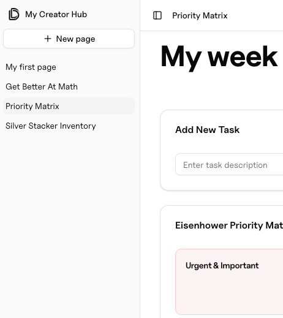
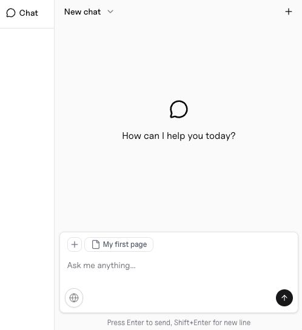

import { ChatIcon } from "/snippets/ChatIcon.jsx";

## Davia pages are “living documents”

They follow a unique architecture combining editable content with interactive components.
Each page is self-contained: it holds your content, your interactive components, and your data. Think of it as **a document you can read, edit, and interact with**.

<video
  autoPlay
  muted
  loop
  playsInline
  className="w-full rounded-xl"
  src="https://sucwjjaupmhspxqdhyep.supabase.co/storage/v1/object/public/davia-public-assets/Showcase_2.mp4"
></video>

This is a new authoring paradigm: code is generated and compiled on the fly as you work. Describe what you need and the page can become anything—custom UI,
logic, and data flows—without fixed blocks or rigid templates.

## A single hub for creating, using, and sharing interactive docs

### All your documents in one workspace

<Columns cols={2}>
  <Frame>
    </img>
  </Frame>
  <Card title="On the left side of the screen your workspace">
     
    Whether you have a page with multiple components or just notes, each one of them
    is accessible in the tree on the left side of your screen.  
      Your can create new pages, insert subpages in a current one or rename
    it. All in all, your **workspace behaves like a filesystem**.
  </Card>
</Columns>

All your pages are aggregated in your **workspace** which serves as your **personal document hub**.
Bear in mind that once you import an interactive document to your workspace, it becomes your personal copy. Any data stored is specific to your usage and **remains private to you**.

<Card
  icon="square-dashed-mouse-pointer"
  horizontal
  href="import-a-doc"
  arrow="true"
>
  Davia makes it easy to import interactive pages from the public doc hub. Click
  here to learn more.
</Card>

### Create, edit documents and navigate your workspace using the agent

Davia's assistant can create or edit your pages through natural language.
Simply describe what you want, and it will build it for you.
Access in right sidepane with command ⌘K or by clicking on the <ChatIcon /> icon on the upper right.

<Columns cols={2}>
  <Card title="This chat is your working partner. Here's what it can do:">
      • **Content Creation & Editing** - Create and edit pages/components
      • **File Management** - Read, create, delete, and organize workspace files
      • **Data Handling** - Store, update, and process user data and
    interactions
      • **Search & Web Integration** - Find workspace content and research topics
    online
  </Card>
  <Frame>
    </img>
  </Frame>
</Columns>

### Publish your page as a live site

Publish any interactive document as a Davia site with its own URL.

<Card
  title="One-Click Publishing"
  icon="share"
  horizontal
  href="publish"
  arrow="true"
>
  Learn how to publish a page as a live site.
</Card>

### Open Source your interactive documents - Become a creator

<Columns cols={(2, 2)}>
  <Card
    title="Become a Creator"
    icon="pencil-ruler"
    href="creators/become-a-creator"
    arrow="true"
  >
    Follow the steps to get verified and become a creator.
  </Card>
  <Card
    title="Publish as templates in seconds"
    icon="rss"
    href="creators/publishing-as-template"
    arrow="true"
  >
    Once your document is ready, publish it as a reusable template on our open
    source doc hub.
  </Card>
  <Card
    title="Start Earning"
    icon="hand-coins"
    href="creators/start-earning"
    arrow="true"
  >
    Monetize the usage of your published docs. Click here for our monetizing
    policy.
  </Card>
  <Card
    title="Share on our socials"
    icon="reddit"
    href="https://www.reddit.com/r/davia_ai"
  >
    Join the community!
  </Card>
</Columns>
