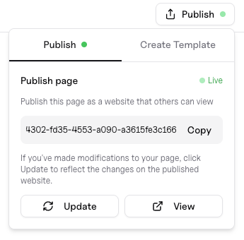

import { PublishIcon } from "/snippets/PublishIcon.jsx";

On any page, publish your document in one click—use the <PublishIcon /> button in the upper right.
Then choose between two publishing options:

## 1. Standard Publishing (live site)

The default way is to publish your interactive page as a Davia site with its own URL.

<Columns cols={2}>
  Once you've clicked on the <PublishIcon /> button and after your doc is
  finally published, it'll open up a menu with:
     - **Your doc's live URL**: when your document is live, you can access
  its URL.
   - **Triggered updates**: edits you make are reflected once you click the
  **Update** button.
  
</Columns>
 

### Persistent Data

Your doc can store events and aggregate interactions that you've defined.  Imagine a simple
leaderboard page that counts each user's upvote. Every time someone clicks Upvote,
that count is saved in your doc's data. Because the data is persisted, once your
page is public the totals keep increasing with every visitor interaction — you've
essentially deployed a small app.

<Warning>
  Be careful when updating a published document: changing component fields or
  the data structure can break the live document and existing data.
</Warning>

<Tip>
  **Great for**: quick sites like portfolios, docs, blogs, or small knowledge
  bases.
</Tip>

## 2. Publish as a Template (open source)

Publish your doc to the hub as an **open source** template. Users can **import it into their workspace**; the import becomes a **personal copy**, and their edits and data are **private to them**.
This is also the way to **earn money** from your published docs. Head over to our [creators section](/creators/publishing-as-template) to learn more about it.
